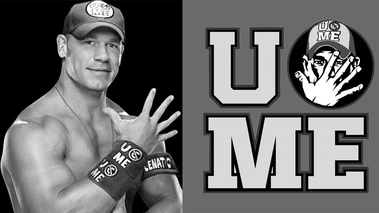
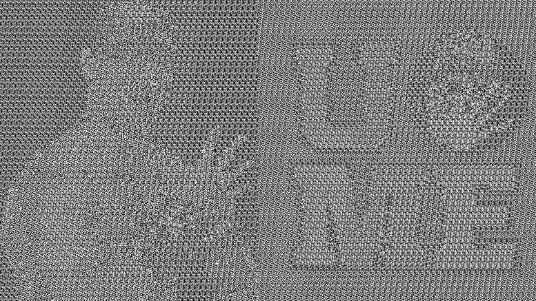
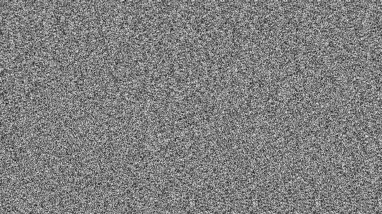

# Tryby szyfrów blokowychAdres URL

W zadaniu, należy zaprojektować "szyfrowanie" obrazu graficznego. Obraz powinien być czarno-biały i mieć rozmiar rzędu kilkuset pikseli w pionie i w poziomie. Obraz taki należy podzielić na małe bloki, np. 8x8 pikseli, w ten sposób każdy blok grafiki zostaje potraktowany jako blok szyfru blokowego. Cały obraz należy potraktować jako ciąg małych bloków, np. przeglądanych kolejnymi wierszami. W naszym przypadku nie dysponujemy własną implementacją szyfru blokowego, w celu wykonania zadania można przyjąć dowolne przekształcenie, bez koniecznosci "odszyfrowywania" kryptogramu, jest istotne, by takie same bloki były identycznie szyfrowane. Np. można zastosować jakąkolwiek funkcję skrótu, md5sum czy sha1sum.

**Uwaga**: celem zadania jest zrozumienia działania trybów blokowych, a nie tylko ich nazw. W związku z tym w rozwiązaniu nie można stosować gotowych bibliotek wywołujących szyfrowanie w jakimkolwioek trybie szyfru blokowego.

Program powinien wczytać plik graficzny i wyprodukować dwa pliki graficzne: kryptogram zaszyfrowany w trybie ECB oraz kryptogram zaszyfrowany w trybie CBC. Należy pamiętać, że obrazek powinien być maksymalnie nieskomplikowany, np. jakiś znak firmowy albo powiększona do dużych rozmiarów czcionka. Przykłady: obrazek jest przekształcany w trybie ECB oraz CBC i drugi obrazek, ECB i CBC.

<table>
    <tr>
        <td></td>
    </tr>
  <tr>
    <td></td>
  </tr>
    <tr>
    <td></td>
  </tr>
</table>
